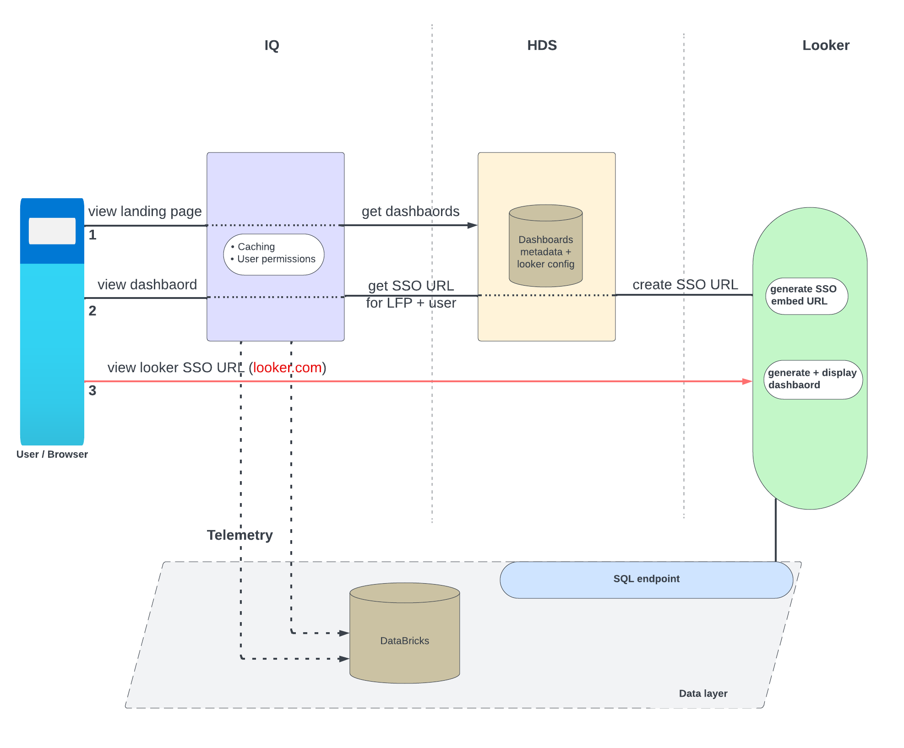

# ADR 7. Looker integrated enterprise reporting architecture - Accepted

Date: 2023-10-31

## Status

Accepted

## Context

As part of [Integrated Enterprise Reporting v1](https://sonatype.atlassian.net/browse/CLM-26852) and 
[dynamic landing page](https://sonatype.atlassian.net/browse/CLM-27739) initiatives, we are in the process of
introducing next generation data-insights for IQ users with enhanced visualization capabilities provided by 
[looker](https://cloud.google.com/looker).  

The solution uses the looker cloud offering which requires IQ to integrate directly with looker cloud which is a key 
architectural change. IQ self-hosted offering's only requirement thus far was the connectivity with Sonatype Data Services 
(HDS) but with this IQ self-hosted requires connectivity enabled with looker cloud service. 

Below is a high-level representation of how this integration works.

1. User views the new data-insights page. IQ renders the data-insights home (a.k.a landing) page. The home page renders
list of available dashboards based on the data retrieved from HDS. 
2. User selects a dashboard from the dashboards list in home page. IQ request for a customer (license) and logged-in user 
specific secure link to the selected dashboard (SSO Embed URL) from HDS. HDS creates and returns a request specific
SSO Embed URL using looker REST endpoints.    
3. IQ renders the SSO Embed URL in an iFrame using looker client SDK. The looker SDK creates and renders the dashboard 
generated by looker cloud.     

## Decisions

- All looker configurations (including region specific URLs and secrets) will be stored and used only in HDS.
- All data-insights dashboards are stored and managed in HDS (ODS database).
- The management of dashboards in HDS will be a manual process. (This could be automated in the future)
- IQ keeps a temporary cache of the dashboard metadata. (to avoid having to download this with every request)

## Consequences

- All IQ customers intending to use this feature requires enabling direct access to looker.com from IQ.
