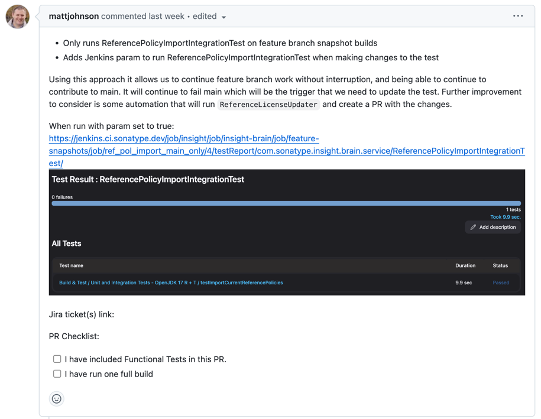
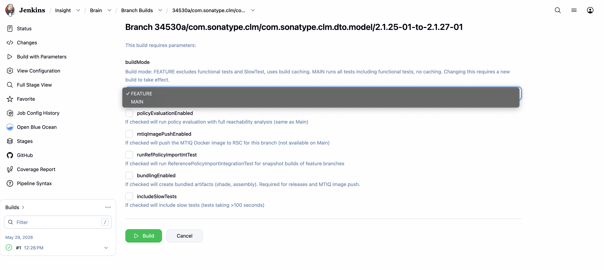

# Full builds

### PR Checklist
A insight-brain PR template has two checkboxes at the bottom. One is for the functional tests which can be considered optional. 
The other informs that you have done a full build before merging to main branch, this should be considered mandatory.

To run a full build you have to go to Jenkins on the `Build with parameters` section for the
specific [feature snapshot you're working on](https://jenkins.ci.sonatype.dev/job/insight/job/insight-brain/job/feature-snapshots/) and select `MAIN` from the dropdown.

This is what is considered a full build. It will prevent merging issues on main. There is an
automatic pipeline that runs every time you commit, but it does not run the full build by default.
