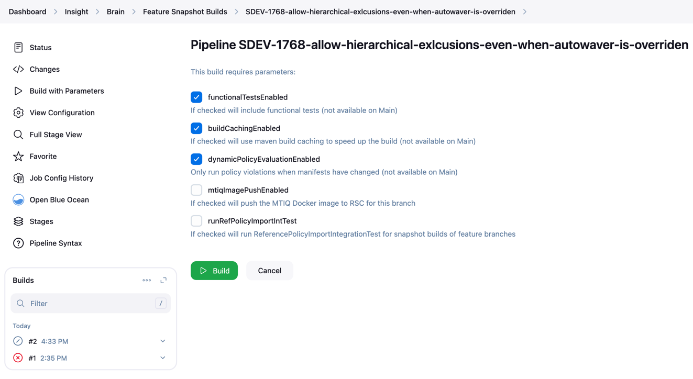

<!--

    Copyright (c) 2011-present Sonatype, Inc. All rights reserved.
    Includes the third-party code listed at http://links.sonatype.com/products/clm/attributions.
    "Sonatype" is a trademark of Sonatype, Inc.

-->
# ReferenceLicenseUpdater

The files `license.sql`, `multi_license.sql` and `multi_license_license.sql` are what IQ actually uses to initialize
the license data in the db when it is installed. They are refreshed from HDS after startup but the data we use for
tests is not refreshed online and has to be maintained every now and then. To do this, run `ReferenceLicenseUpdater`
and commit the files.

Related PR can be found in: https://github.com/sonatype/insight-brain/pull/11348

Now there's also a `runRefPolicyImportIntTest` parameter on Jenkins that is disabled by default and can be used to 
run the `ReferencePolicyImportIntegrationTest` when modifying the test accordingly. Therefore, 
there's no blocker to continuing feature work until the main pipeline is run.

