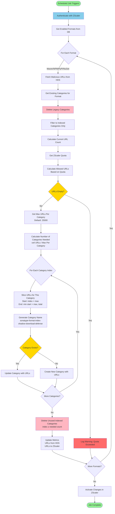

# ZScaler Integration Flow

## Overview

The ZScaler integration in Nexus IQ Server automatically manages URL categories in ZScaler to block malicious package downloads. It fetches malicious component URLs from HDS (Hosted Data Services) and pushes them to ZScaler's custom URL categories, taking into account both per-category and total quota limits.

## Architecture

### Key Components

- **ZScalerUpdater**: Scheduled job that orchestrates the entire update process
- **ApiZScalerService**: Core service that manages category creation, updates, and deletion
- **ZScalerClient**: HTTP client for ZScaler API interactions
- **HDSMaliciousUrlFetcher**: Fetches malicious URLs from HDS per format
- **Configuration**: Provides configurable limits and settings

### Supported Package Formats

- Maven
- NPM
- PyPI
- NuGet

## Configuration

### System Properties

| Property | Description | Default |
|----------|-------------|---------|
| `zScalerUpdateTaskPeriod` | Hours between automatic updates | - |
| `zScalerMaxUrlsPerCategory` | Maximum URLs per category | 25000 |

### ZScaler Configuration (Database)

- Hostname
- Username
- Password (encrypted)
- API Key
- Enabled formats (per format toggle)

## Category Naming Convention

### Current Format (Indexed)
```
sonatype-<format>-<index>-shadow-download-defense
```
Examples:
- `sonatype-maven-0-shadow-download-defense`
- `sonatype-maven-1-shadow-download-defense`
- `sonatype-npm-0-shadow-download-defense`

### Legacy Format (Deprecated)
```
sonatype-<format>-shadow-download-defense
```
Examples:
- `sonatype-maven-shadow-download-defense`
- `sonatype-npm-shadow-download-defense`

**Note**: Legacy categories are automatically detected and removed during updates to migrate to the indexed format.

## Update Flow

### High-Level Process

1. **Scheduled Execution**: Job runs every N hours (configurable)
2. **Authentication**: Authenticate with ZScaler API and verify permissions
3. **Format Iteration**: Process each enabled format (Maven, NPM, PyPI, NuGet)
4. **URL Fetching**: Retrieve malicious URLs from HDS for the format
5. **Legacy Cleanup**: Remove old non-indexed categories
6. **Quota Calculation**: Determine how many URLs can be pushed
7. **Category Splitting**: Divide URLs into multiple categories if needed
8. **Category Management**: Create/Update/Delete categories as needed
9. **Activation**: Activate changes in ZScaler
10. **Metrics Update**: Record statistics for monitoring

### Detailed Flow by Format



## Quota Management

### Total Quota
ZScaler provides a total quota for custom URLs across all categories:
```
Total Allowed = Remaining Quota + Currently Provisioned URLs
```

### Per-Format Calculation
When updating a format, the service:
1. Counts URLs currently used by that format's indexed categories
2. Calculates available quota: `Total Allowed - (All Provisioned - Format's Current)`
3. Limits the new URLs to fit within available quota

### Per-Category Limit
- **Default**: 25,000 URLs per category
- **Configurable**: Via `zScalerMaxUrlsPerCategory` system property
- URLs exceeding this limit are automatically split across multiple categories

### Example Scenarios

#### Scenario 1: URLs Fit in One Category
- URLs from HDS: 10,000
- Max per category: 25,000
- Result: 1 category (`sonatype-maven-0-shadow-download-defense`)

#### Scenario 2: URLs Require Multiple Categories
- URLs from HDS: 60,000
- Max per category: 25,000
- Result: 3 categories
  - `sonatype-maven-0-shadow-download-defense` (25,000 URLs)
  - `sonatype-maven-1-shadow-download-defense` (25,000 URLs)
  - `sonatype-maven-2-shadow-download-defense` (10,000 URLs)

#### Scenario 3: Quota Exceeded
- URLs from HDS: 50,000
- Available quota: 30,000
- Result: Only 30,000 URLs pushed (oldest/highest priority retained)
- Warning logged

## Legacy Category Migration

### Detection
Legacy categories are identified by exact name match:
```
sonatype-<format>-shadow-download-defense
```

### Migration Process
1. **Before any updates**: Scan for legacy categories matching the format
2. **Delete legacy categories**: Remove all detected legacy categories
3. **Proceed with indexed creation**: Create new indexed categories with fresh data

### Benefits
- **Clean transition**: No duplicate data in old and new formats
- **Automatic**: No manual intervention required
- **Quota efficient**: Frees up quota by removing old categories first

## Error Handling

### Authentication Failures
- Invalid credentials: Exception thrown, job fails
- Insufficient permissions: Validation during auth, clear error message
- Required permissions:
  - `OVERRIDE_EXISTING_CAT` (READ_WRITE)
  - `CUSTOM_URL_CAT` (READ_WRITE)

### Quota Issues
- Quota exceeded: URLs limited to available quota, warning logged
- Empty allowed URLs: Operation skipped, warning logged
- Metrics track: URLs from HDS vs. URLs actually pushed

### API Failures
- Category creation failure: Logged as warning, continues with other categories
- Category update failure: Logged as warning, continues
- Activation failure: Logged as error, but previous operations completed
- Delete failure: Logged as warning, continues

## Monitoring and Metrics

### Tracked Metrics (per format)
- **URLs from HDS**: Total malicious URLs fetched
- **URLs to ZScaler**: Actual URLs pushed (after quota limits)

### Metrics Storage
Stored in `ZScalerMetrics` entity with fields:
- `mavenUrlsFromHds` / `mavenUrlsToZscaler`
- `npmUrlsFromHds` / `npmUrlsToZscaler`
- `pypiUrlsFromHds` / `pypiUrlsToZscaler`
- `nugetUrlsFromHds` / `nugetUrlsToZscaler`

### Log Levels

| Level | Event |
|-------|-------|
| INFO | Authentication success, category creation/update, deletion |
| WARN | Quota issues, no URLs to update, API failures |
| ERROR | Authentication failures, critical errors |
| DEBUG | Quota details, configuration values used |

## API Operations

### ZScaler API Endpoints Used

| Operation | Method | Endpoint | Purpose |
|-----------|--------|----------|---------|
| Authenticate | POST | `/api/v1/authenticatedSession` | Get session cookie |
| Get Admin | GET | `/api/v1/adminUsers/me` | Verify user details |
| Get Role | GET | `/api/v1/adminRoles/{id}` | Verify permissions |
| Get Categories | GET | `/api/v1/urlCategories?customOnly=true` | List custom categories |
| Get Quota | GET | `/api/v1/urlCategories/urlQuota` | Check available quota |
| Create Category | PUT | `/api/v1/urlCategories/{name}` | Create new category |
| Update Category | PUT | `/api/v1/urlCategories/{id}` | Update existing category |
| Delete Category | DELETE | `/api/v1/urlCategories/{id}` | Remove category |
| Activate | POST | `/api/v1/status/activate` | Apply changes |

### Authentication Flow
1. Obfuscate API key with timestamp
2. POST credentials to `/authenticatedSession`
3. Extract JSESSIONID cookie
4. Fetch admin user details
5. Fetch and verify role permissions
6. Use session cookie for subsequent API calls

## Performance Considerations

### Batching
- All URLs for a category sent in single API call
- Categories processed sequentially per format
- Formats processed sequentially

### Caching
- Quota cached for 1 hour to reduce API calls
- Cache invalidated after category updates

### Scheduling
- Default: Manual trigger or periodic (configurable hours)
- Recommended: Run during low-traffic periods
- Job marked `@DisallowConcurrentExecution` to prevent overlaps

## Best Practices

### Configuration
1. **Set appropriate max per category**: Balance between API limits and manageability
2. **Monitor quota usage**: Track metrics to understand consumption
3. **Enable only needed formats**: Reduces processing time and quota usage

### Monitoring
1. **Check metrics regularly**: Verify URLs are being pushed successfully
2. **Watch for quota warnings**: May need to increase ZScaler subscription
3. **Review logs**: Identify any persistent API failures

### Maintenance
1. **Keep credentials updated**: Rotate API keys periodically
2. **Verify permissions**: Ensure role has required permissions
3. **Test after changes**: Use manual trigger to verify configuration

## Security Considerations

### Credential Storage
- Passwords encrypted in database using `PasswordHandler`
- API keys obfuscated before transmission
- Session cookies used for authenticated requests

### Permissions
- Minimum required permissions enforced during authentication
- Role validation happens at connection time
- Failed permission checks prevent any operations

### Data Protection
- URLs transmitted over HTTPS
- No sensitive data logged
- Session management handled by ZScaler

## Troubleshooting

### Common Issues

| Issue | Cause | Solution |
|-------|-------|----------|
| No categories created | Feature not enabled | Enable ZSCALER feature flag |
| Authentication fails | Invalid credentials | Verify username, password, API key |
| Quota always exceeded | Too many URLs | Increase ZScaler quota or enable fewer formats |
| Categories not visible | Not activated | Check activation step succeeded |
| Legacy categories remain | Name mismatch | Verify exact format name matching |

### Debug Steps
1. Check feature flag: `SystemConfigurationPropertyFeature.ZSCALER`
2. Verify configuration: Hostname, credentials, enabled formats
3. Review logs: Look for authentication, quota, API errors
4. Check metrics: Compare HDS vs ZScaler counts
5. Test quota: Use `/api/v2/zScaler/quota` endpoint
6. Manual trigger: Use `/api/v2/zScaler/update` to test outside schedule