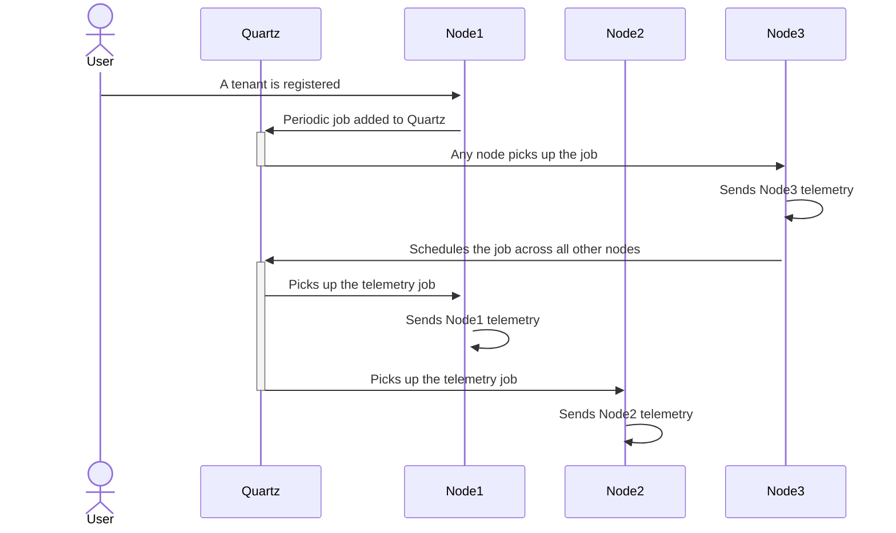

<!--

    Copyright (c) 2011-present Sonatype, Inc. All rights reserved.
    Includes the third-party code listed at http://links.sonatype.com/products/clm/attributions.
    "Sonatype" is a trademark of Sonatype, Inc.

-->
# Tenancy Module

This module provides classes that support multi tenancy. To understand how tenants are used start by reviewing the
[Tenant Data Flow Diagram](https://docs.sonatype.com/display/MTIQ/Tenant+Data+Flow+Diagram).

## Vanity URLs

Multi tenant mode makes use of vanity URLs to know which tenant is currently being used.

Note: localhost will not work in multi tenant mode, instead you will need to modify your hosts file or equivalent to
access MTIQ. The list of allowed URLs is in TenantUtils.

## Tenant Security

It is mission critical that we have a clear separation between tenant's data and that data never leaks between two
different tenants.

### Background

Getting to our solution requires understanding two things:

1. There are only two entry points* for code to be executed. A http request (which comes through `TenantUrlFilter`) or a
   quartz job (which will go through `TenantContextJobListener`). These are the only two places that actually need to
   change/set the tenant. Both of these entry points are under our direct control and are therefore trusted.
2. Its not actually setting the tenant we need to secure. What we actually want to do is ensure that a request or job
   for TenantA can never read or update data from TenantB. We also control the access to the database and file system,
   and both of those routes must call `getTenant()` before they can get data for that specific tenant. So actually it is
   `getTenant()` where we need to do the check/validation.

* _There are likely other entry points that haven't yet been explored. For example, integrations like SCM and JIRA._

### Approach

Our approach is to tightly lockdown which classes can change the current tenant to only the two trusted paths,
`TenantUrlFilter` and `TenantContextJobListener`. This is done with package level security (Note: we still need to
disable
reflection, that is not done yet). The problem then is new threads, originally we used a `ThreadLocal` so new threads
would have had a null
tenant and therefore needed to set the tenant before they could begin work, but they aren’t trusted. To solve this we
swapped the `ThreadLocal` with an `InheritableThreadLocal`, this means that any new thread created will automatically
get the tenant of the parent thread. This has another advantage of meaning we don’t need to change all the places where
asynchronous work is done, making our changes much less invasive (except in the case of thread pools).

The next problem then becomes thread reuse (thread pools). `InhertiableThreadLocal` only passes the tenant when the
thread is created, not when the thread is reused. This means if a request for TenantA comes in, creates a thread in a 1
thread pool finishes, and then a request for TenantB comes in that will use a thread that is pointing at TenantA. This
is solved by using the `TenantAwareRunnable` class which correctly handles propagating the tenant (it uses the tenant at
the point the runnable is created rather than the thread).

The remaining problem is then, what happens if a developer creates a native thread, within a pool, and forgets to use
`TenantAwareRunnable`? We’ve introduced tenant invalidation. When the two trusted entry points start their work, they
create a new instance of the tenant for the current thread and all subsequent threads, when they are finished, they call
`tenant.invalidate()` which sets a flag. If the tenant is invalidated and a subsequent call to `getTenant()` happens
then
a `RuntimeException` will be thrown, preventing any data access.

### Problems

There is a potential loop-hole here which involves parallel requests and re-used threads but is highly unlikely IMO.
Threading work doesn’t happen often, less so within a thread pool, however when it does, we need to encourage good
practice (making use of TenantAwareRunnable) and failing that the tenant validation is incredibly likely to catch a
mistake before we release (it will break the feature as soon as tenant reuse is encountered)
This could happen if you have two requests at the same time, a developer has used a native thread (not the tenant aware
class) and they’re also making use of a thread pool. (A lot of ifs). If the first task finishes and then before the
request has invalidated the tenant the second task starts, it will pick up the wrong tenant. This requires perfect
timing and our development team to screw up in a very perfect way.
The saving grace is that as soon as this situation is hit where the timing is off (the most likely scenario) we will hit
the runtime exception and notice very fast. This will only while the very first request hasn't been invalidated. As soon
as it has we will see the exception.

### Valid tenant transitions

To further guard against mistakes we define a set of allowed/disallowed tenant transitions. Essentially before changing
from one tenant to another the current tenant _must be invalidated_. The only exception is when making use of Global.

- Tn = Individual tenant (e.g. T1 is tenant1, T2 is tenant2)
- G = The Global tenant
- (V) = A valid tenant
- (In) = An invalid tenant

#### Allowed transitions

1. T1(V) → T1(In) → T2(V)
2. T1(V) → G → T1(V)
3. T1(V) → T1(V)

#### Disallowed transitions

1. T1(V) → T2(V)
2. T1(V) → T2(In)
3. T1(V) → G → T2(V)

## Asynchronous work

A tenant is tracked using an `InheritableThreadLocal`. This means the tenant is associated with a thread and
automatically propagated to child threads.

Care needs to be taken when reusing threads (for example within a thread pool) because the tenant is only propagated
when the thread is created, not when it is (re)used. There are a number of classes that make this easy. If work is not
wrapped in one of these classes then `RuntimeExeception`'s will be thrown.

There are three types of asynchronous work supported

1. Parallel Processing: Work that finishes within the current context (i.e. while the tenant is still valid).
2. Fire-and-forget: Work that can possibly finish after the request (i.e. after the tenant has been invalidated).
3. Periodic work: Scheduled work

### Parallel Processing

For work that will finish within the current context, the tenant that was created in the context can be used for the
asynchronous work. Most likely this type of work will involve something akin to `parallelStream` or `CompletableFuture`.
To ensure the correct tenant is used in these cases the work should be wrapped in one of the following classes:

* `TenantAwareFunction`
* `TenantAwareSupplier`

If these classes are used outside the current context (e.g. after a request has finished) then exceptions will be
thrown because the tenant will be invalid. For those cases see fire-and-forget.

### Fire-and-forget

Sometimes a request will start, and then we want to start a long-running piece of work but finish the request. In those
cases we can't reuse the tenant that was created with the request because it will be invalidated when the request
finishes. To support this use case make use of:

* `TenantAwareOneTimeRunnable`
* `TenantAwareOneTimeCallable`

These classes clone the current tenant (provided it is currently in a valid state) and then will invalidate the tenant
when finished. They cannot be reused, by design.

### Periodic work

Work that needs to run on a schedule will need its own context. The best way to handle this is to make use of Quartz
which handles getting and setting the tenant. Custom scheduling outside of Quartz is not currently supported.

#### Telemetry

Telemetry has essentially 2 operating modes. The first is a mode that is predominantly sending cluster information such
as environment variables and common data from the database, as such a periodic quartz job is scheduled for each
registered tenant resulting in a single node picking up the task for each tenant.

The second mode (`MultiTenantTelemetryScheduler`) in a multi tenant setup also makes use of a periodic quartz job with
the addition of immediately triggering a second job (`MultiTenantTelemetryTask`) across all the other nodes to also send
Telemetry without re-triggering. This is currently a different mechanism to on-prem which uses an ExecutorService
approach.



### Configuration

Configuration is per-tenant unless no value is found and then the system will fall back to the configuration table in
the global tenant schema. This allows us to provide meaningful defaults but also to override configuration for a
given tenant.

### Bean Lifecycles

* **Managed** - these are beans that follow the lifecycle of the application, start is called on application start and
  stop is called when the application is shutdown.

* **TenantManaged** - These are beans that follow the lifecycle of a tenant. Register is called when a tenant is booted
  and deregister is called on both shutdown of the application and also removal of the tenant.

* **InsightJob** - A bean that also represents a quartz job - All InsightJobs are TenantManaged (i.e. register is called
  on them when the tenant is booted). This is convenient so that all quartz jobs, by default, get registered for each
  tenant. Having the default this way around prevents new Quartz jobs (that should be per-tenant) accidentally being
  global. To make a job global it has to be explicitly annotated with GlobalTenantJob

* **GlobalTenantJob** - These are specifically quartz jobs (therefore implement InsightJob) which should NOT run
  per-tenant. Mainly used for updating global cache data (like information from HDS)

### User Sessions (Shiro)

We use Shiro to manage user sessions which then get persisted in the database. 

For MTIQ we need to make sure all sessions are managed per-tenant. The ShiroSessionDAO ensures that all database access 
is done via the correct tenant and schema. There is a session cache in ShiroSessionDAO#SESSION_CACHE however this is not
a problem for MTIQ for 2 reasons; Session caching is disabled when using SAML, which we are, however even if we did not
use saml this would still work as expected because all sessions are given an ID that is unique across all tenants.

Shiro sessions are expired periodically (default every 30 minutes). In the default implementation this is done 
using a ScheduledThreadPoolExecutor which can't correctly get the current tenant and often ends up running against
a cached (wrong) and invalidated tenant. Session expiration is a truly asynchronous process and runs outside any
request context and is therefore a type of [Periodic Work](#periodic-work). Following those recommendations we make use
of Quartz for session expiration by creating a custom QuartzShiroSessionValidationScheduler that can be scheduled for
each tenant.

### Banning Implementations

It may be desirable to ban some classes or packages, see
this [readme](/nexus-mtiq-server/src/main/java/com/sonatype/insight/brain/service/banning/readme.md) to understand how
that has been made possible for mtiq.

#### Banned REST implementations

As a result of CLM-23906, CLM-23907 certain REST resources have been banned by two different banning implementations.
PermanentlyBannedRestResources lists all REST resources that we currently believe will never make sense for MTIQ and
MilestoneOneBannedRestResources bans resources that are just not needed for the initial Firewall release. When we come
to re-enable the Lifecycle functionality MilestoneOneBannedRestResources will need changing.

## Admin Endpoints

In a multi tenant environment, we need a mechanism to let us configure/manage the different tenants that may
exist, and additionally the same mechanism should let us configure/manage, the multi tenant environment itself. 
Here are some examples:
- We need a way to provision a tenant
- We need to get information of a tenant for support purposes 
- We also need to modify/manage common configurations

For that purpose we have defined what we call the Admin Endpoints. These are REST resources that will be 
available under the admin port for MTIQ(8071).

The admin endpoints are designed to live in a separate Jersey environment, which means that we cannot
access the app endpoints from the admin port, and we cannot access the admin endpoints from the app 
port. This level of isolation give us a couple of benefits:
- We can ensure the admin endpoints are only for internal use
- We can create admin endpoints that can configure multiple tenants or system level aspects in a simpler way
- We avoid any accidental exposure of the admin endpoints thorough the vanity URLs

To check the existing Admin Endpoints, you can check the resources 
[here](../nexus-mtiq-server/src/main/java/com/sonatype/insight/brain/api/admin)

### Tenant Provisioning

For MTIQ the initial step for on-boarding any new customer, will be to ensure the DB is set up for them.
This includes the schema creation and the proper creation and population of the tables, this is what
we call the tenant provisioning process.

For tenant provisioning we have created a new admin endpoint. You can run the next command to provision a
new tenant:
```bash
curl -X POST http://{mtiq-ip-address}:8071/api/admin/tenants/{tenant-slug}

# Here is an example

curl -X POST http://127.0.0.1:8071/api/admin/tenants/cubs

# This will provision tenant with name "cubs"
```

### Install/Update Tenant License

For MTIQ we also need a proper way to manage the license needed for a tenant. For that purpose we have created a new
admin endpoint to install or update a license for a tenant. This new endpoint will help us to automatically install 
the license for a tenant after it is provisioned, so the customer will not need to execute this step manually. 

The final goal is to not depend on a license file, but for now the endpoint expects this file. You can run the next 
command to install/update a new tenant:
```bash
curl -F file="@/path/to/license.lic" -X PUT http://{mtiq-ip-address}:8071/api/admin/tenants/{tenant-slug}/license

# Here is an example

curl -F file="@sonatype.lic" -X PUT http://127.0.0.1:8071/api/admin/tenants/cubs/license

# This will install/update the license for the tenant "cubs"
```